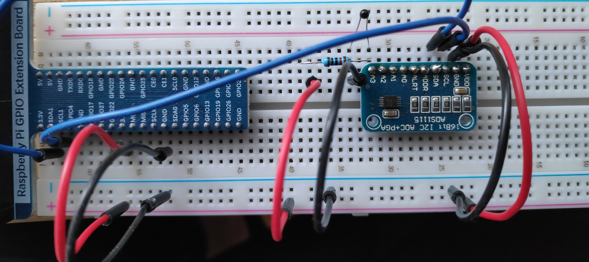

## ADS1115 and Thermistor high accuracy thermometer 

This is an example on how to use an ADS1115, and a thermistor to create a high accuracy thermometer.

## Circuit



* x1 Thermistor 10κΩ
* x1 Resistor 10κΩ
* x1 ADDS 1115

## Golang code

The code opens a go channel and reads continuously the value from the adc channel (0 - 26400) at the frequency the pin has been configured.
Then calculates and displays the Temperature in Celsius and in Kelvin.

To run it:

```
go run main.go
```